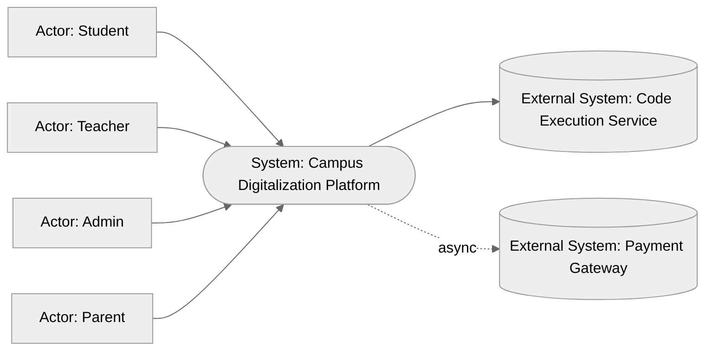
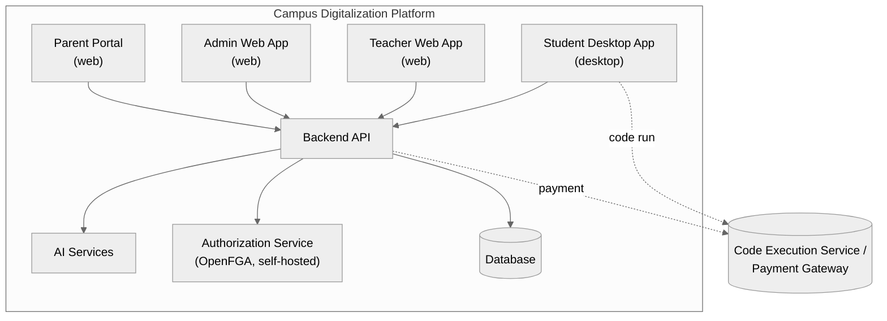
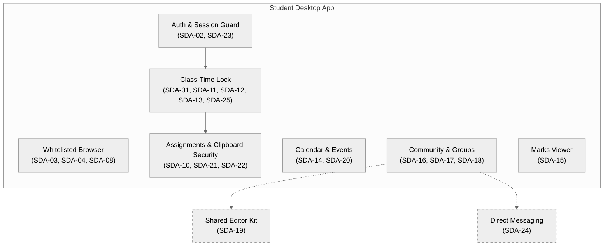
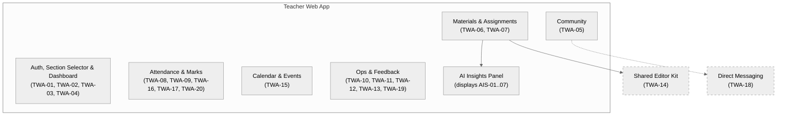
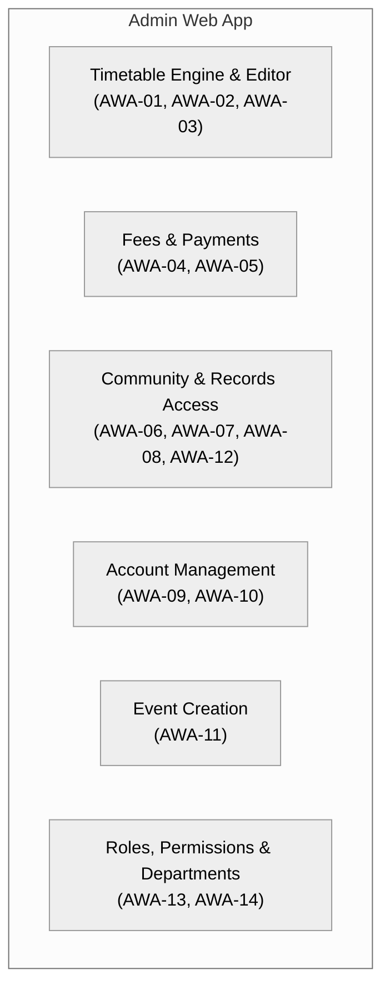
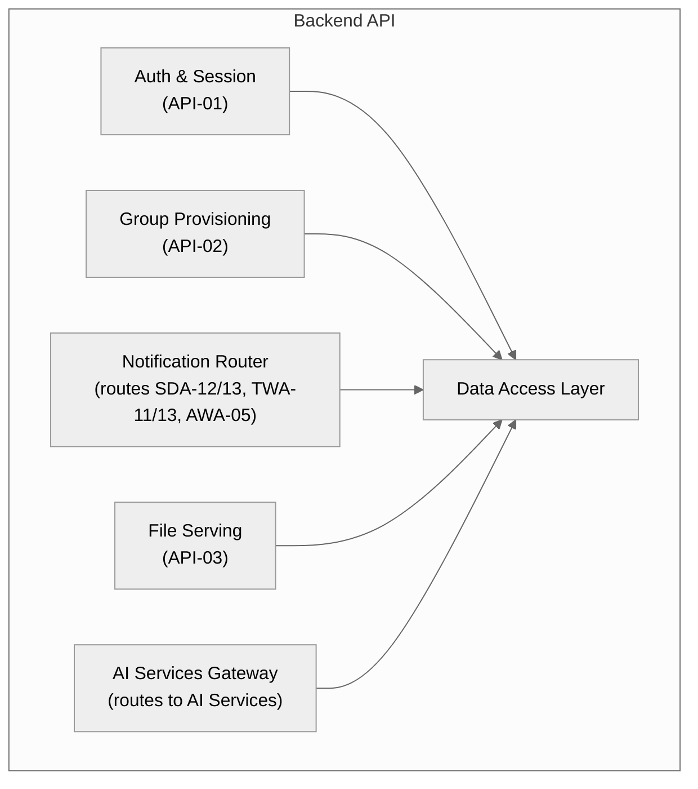

# Campus Digitalization Platform — Architecture

## 0. Naming & Notation Registry [Core]

| Element | Canonical Name | Code | Type |
|---|---|---|---|
| Student | Student | — | Actor |
| Teacher | Teacher | — | Actor |
| Admin | Admin | — | Actor |
| Parent | Parent | — | Actor |
| Student desktop application | Student Desktop App | SDA | Container |
| Teacher web application | Teacher Web App | TWA | Container |
| Admin web application | Admin Web App | AWA | Container |
| Shared backend | Backend API | API | Container |
| Primary data store | Database | DB | Container |
| AI-driven subsystem (plagiarism, autograding, browsing summary) | AI Services | AIS | Container |
| Third-party code runner | Code Execution Service | CEX | External System |
| Third-party payments | Payment Gateway | PAY | External System |
| Shared code/document/notes editor, used by both SDA and TWA | Shared Editor Kit | SEK | Component (shared, cross-container) |
| Shared 1:1 messaging, used by both SDA and TWA | Direct Messaging | DMS | Component (shared, cross-container) |
| Parent-facing web application | Parent Portal | PRT | Container |
| Fine-grained authorization engine — evaluates all permission checks; self-hosted OpenFGA decided (Section 16) | Authorization Service | AUTHZ | Container (self-hosted) |

**Diagram legend** (reused on every diagram in this document):

| Symbol / Style | Meaning |
|---|---|
| Solid box | Container (independently deployable) |
| Dashed box | Component (internal to a container, or shared across containers) |
| Solid arrow → | Synchronous call / dependency |
| Dashed arrow ⇢ | Async / event / message |
| Cylinder | Data store |

---
## 1. Overview & Objectives [Core]

**One-paragraph summary:** A single platform unifying three role-specific applications — a locked-down Student desktop app, a Teacher web app, and an Admin web app — on one shared backend and data model, replacing the separate LMS + ERP + proctoring-tool stack most colleges run today.

**Problem statement:** Campus tools (LMS, attendance, timetable, fees, community/groups) are normally separate systems that don't share data. This platform puts student, teacher, and admin workflows on one backend so a single action (e.g. a teacher marking attendance, or a student submitting an assignment) is immediately visible to every role that needs it.

**Objectives:**
1. Every student/teacher/admin workflow listed in Section 3 is reachable from its role's app without a separate tool.
2. Class-time engagement is enforced (full-screen + exit notification) only during scheduled class or assignment windows — never as a standing background restriction.
3. Assignment plagiarism/copy-checking and grading run automatically and land in front of the teacher for review, not for blind auto-posting.
4. Timetable generation is automatic by default but always manually overridable by Admin.

**Non-goals / Out of scope:**
- Exam-lockdown hardening (VM detection, screen-recording detection, webcam-based AI proctoring). This is daily-use software, not an exam-proctoring tool — confirmed explicitly.
- Voice-recognition attendance, Google Calendar sync, WhatsApp/auto-call fee reminders — named by the person as future-phase, not this round.
- Admissions/enrollment intake, mobile apps, hostel/transport/library modules — not mentioned in the request; not included here.
- **Role/permission model (RBAC)** — replaces the flat Teacher/Admin distinction. Decided: Roles + individual permission overrides (Google IAM style), with mixed scoping (Finance/IT/Admin global, HoD/Lecturer scoped to their department). Modeled in Section 9.

---

## 3. Features [Core]

### Features — `Student Desktop App` (`SDA`)

| ID | Feature | Description | Priority | Requirement (EARS) | Acceptance Criteria |
|---|---|---|---|---|---|
| SDA-01 | Class-time full-screen lock | App goes full-screen and blocks switching away during a scheduled class session | Must | While a scheduled class session is active, the Student Desktop App shall enforce full-screen mode and block switching to other applications. | Outside class hours, no restriction applies; during class hours, Alt-Tab/window-switch is blocked. |
| SDA-02 | Login (Roll No + Password + TOTP) | Three-factor login, custom-built end to end (decided: no third-party Authentication Service) | Must | When a student submits roll number, password, and a TOTP code, the Student Desktop App shall authenticate against the Backend API and grant access only if all three are valid. | Wrong password, wrong TOTP, or unknown roll number each reject login with a distinct message. |
| SDA-03 | Whitelisted built-in browser | Navigation restricted to an approved site list | Must | While browsing inside the Student Desktop App, the system shall restrict navigation to sites on the class's approved whitelist. | Navigating to a non-whitelisted URL is blocked with an explanatory message. |
| SDA-04 | Whitelist addition request | Student can ask teacher to add a site; approval applies institution-wide, not just the requesting student's class | Should | When a student requests a new site be added to the whitelist, the Student Desktop App shall forward the request to the Teacher Web App for approval; once approved, the site becomes browsable for every student in the College. | Teacher sees a pending-request queue; approval makes the site browsable for the whole institution without a student-side restart. |
| SDA-08 | Browser clipper into notes | Clip content from the built-in browser straight into a note | Should | When a student clips content from the built-in browser, the Student Desktop App shall save it as a new note or append it to an existing one. | Clipped content retains source URL as a reference. |
| SDA-10 | Assignment submission | Upload assignment files with a timestamp; format depends on the assignment's type | Must | When a student submits an assignment, the Student Desktop App shall accept the format matching the assignment's type (code, quiz answers, essay text, or file upload), upload it to the Backend API, and record a submission timestamp. | Submission after the deadline is flagged as late, not silently accepted as on-time; a quiz-type assignment cannot be submitted as a file upload. |
| SDA-11 | Auto-submit on exit during assignment window | Losing focus/exiting mid-assignment force-submits current state | Must | If a student exits or loses focus of the Student Desktop App during an active assignment window, then the system shall auto-submit the current state of the assignment. | Teacher's view marks the submission as auto-submitted, distinct from a manual submit. |
| SDA-12 | Exit notification during class | Leaving the app during class pings the teacher | Must | If a student exits the Student Desktop App during a scheduled class session, then the Backend API shall notify the assigned teacher in real time. | Teacher receives the notification within a few seconds of the exit event. |
| SDA-13 | No-login-while-marked-present alert | Marked present but never logged in pings the teacher after a 20-minute grace period | Should | If a student is marked present for a session but has not logged into the Student Desktop App within 20 minutes of the session start, then the Backend API shall notify the assigned teacher. | Notification fires once per session, not repeatedly, and only after the 20-minute window elapses. |
| SDA-14 | Calendar | College-wide events, registered events, to-dos, custom events in one view | Must | The Student Desktop App shall display college-wide events, events the student is registered for, personal to-dos, and custom events in a single calendar. | All four event types are visually distinguishable in the same view. |
| SDA-15 | Marks viewing | View published marks per subject/assignment | Must | The Student Desktop App shall display a student's marks as published by teachers, per subject and assignment. | Unpublished marks are not visible to the student. |
| SDA-16 | Community groups | View/post in class, subject-section, and club groups; shared materials surface in Materials | Must | The Student Desktop App shall let a student view and post in groups they belong to, and shall surface any material shared in a group inside that group's Materials section. | A file posted in a group appears in Materials without a separate upload step. |
| SDA-17 | Teacher feedback | Submit feedback about a teacher/course | Should | The Student Desktop App shall let a student submit feedback about a teacher or course. | Feedback is attributable to the course/teacher it was submitted against. |
| SDA-18 | Course & teacher info | View course and teacher info per enrolled subject | Should | The Student Desktop App shall display course information and the assigned teacher's information for each enrolled subject. | Every enrolled subject has a non-empty course-info and teacher-info entry. |
| SDA-19 | Shared Editor Kit integration | Student Desktop App embeds the Shared Editor Kit (SEK-01..05) for code, document, and notes editing rather than implementing its own | Must | The Student Desktop App shall embed the Shared Editor Kit for all code editing, document viewing/annotation, and note-taking. | No editor/annotation/notes logic is implemented directly inside the Student Desktop App outside of SEK. |
| SDA-20 | Event registration screen | Students browse and register for college events from a dedicated screen; an event may be restricted to specific years and/or departments | Must | When a student opens the events screen, the Student Desktop App shall list events open to that student's year and department, and let the student register for any that are open. | A registered event appears in the student's Calendar (SDA-14) automatically; an event restricted to another year/department never appears in the list. |
| SDA-21 | Isolated in-app clipboard | The app uses its own custom clipboard; the OS-level clipboard does not work inside it | Must | While the Student Desktop App is running, the system shall route all copy/cut/paste actions through an isolated in-app clipboard, not the OS clipboard. | Content copied inside the app cannot be pasted into an external application, and vice versa. |
| SDA-22 | Copy/cut/paste block during open assignment | While an assignment is open for editing, all clipboard actions are disabled | Must | While an assignment is open for editing, the Student Desktop App shall block copy, cut, and paste actions entirely, including within the isolated in-app clipboard. | Attempting copy/cut/paste while an assignment is open has no effect and shows a blocked-action message. |
| SDA-23 | Self-service password change with MFA | Student can change their own password but must pass an MFA/TOTP challenge first | Must | When a student requests a password change, the Student Desktop App shall require a successful TOTP challenge before applying the new password. | Password change is rejected if the TOTP challenge fails or is skipped. |
| SDA-24 | Direct Messaging integration | Student side of the shared Direct Messaging component (DMS-01) | Should | The Student Desktop App shall embed the Direct Messaging component for composing and reading messages to/from teachers. | No separate messaging logic exists inside the Student Desktop App outside of DMS. |
| SDA-25 | Usage telemetry for suspicious-behaviour detection | Client-side signal reporting, scoped to class/assignment windows only | Must | While a class session or assignment window is active (SDA-01, SDA-11, SDA-12, SDA-13), the Student Desktop App shall report usage-pattern telemetry to the AI Services container via the Backend API. | No telemetry is collected or sent outside a class session or assignment window. |
### Features — `Teacher Web App` (`TWA`)

| ID | Feature | Description | Priority | Requirement (EARS) | Acceptance Criteria |
|---|---|---|---|---|---|
| TWA-01 | Auto section selection | Timetable-driven default section on login | Must | When a teacher logs in, the Teacher Web App shall pre-select the section they are currently scheduled to teach, based on the timetable. | Correct section is pre-selected without manual search, for any time the teacher logs in during a scheduled period. |
| TWA-02 | Manual section switch | Change active section anytime | Must | The Teacher Web App shall let a teacher switch to any of their assigned sections at any time. | Switching sections updates the dashboard, attendance, and materials view to the new section immediately. |
| TWA-03 | Login (username + password + TOTP) | Same auth scheme as Student, custom-built end to end | Must | When a teacher submits username, password, and a TOTP code, the Teacher Web App shall authenticate via the Backend API. | Same rejection behavior as SDA-02. |
| TWA-04 | Class performance dashboard | Dashboard for the active section | Must | The Teacher Web App shall display a performance dashboard for the teacher's currently selected section. | Dashboard reflects marks/attendance data no older than the last sync. |
| TWA-05 | Community access & group creation | View all groups; create new groups, including club and teacher-only groups (class groups excluded — auto-created) | Must | The Teacher Web App shall let any teacher view community groups and create new groups — including groups visible only to other teachers — other than the auto-provisioned class group. | Every teacher account, regardless of role, can create at least one group; a teacher-only group is not visible to any student. |
| TWA-06 | Material upload | Upload to material section and/or post into a group | Must | When a teacher uploads material, the Teacher Web App shall attach it to the material section, a selected group, or both. | Material posted to a group also appears in that group's Materials section (mirrors SDA-16). |
| TWA-07 | Multi-type assignment creation | Create assignments with due date + submission window; type is code, quiz, essay, or file upload | Must | When a teacher creates an assignment, the Teacher Web App shall let them choose its type — code, quiz, essay, or file upload — set a due date and submission window, and configure type-specific settings. | An assignment with no due date cannot be published; each type stores only the settings relevant to it (e.g. quiz question bank, code starter files). |
| TWA-08 | Attendance marking | Mark attendance per session for the active section | Must | The Teacher Web App shall let a teacher mark attendance per session for the currently selected section. | Every enrolled student has an attendance status after marking is completed. |
| TWA-09 | Attendance alerts | Alert on low attendance, threshold set at 65% | Should | If a student's attendance falls below 65%, then the Backend API shall alert the teacher. | Alert references the specific student and current attendance percentage, and fires the first time attendance crosses below 65%. |
| TWA-10 | Own timetable view | View the logged-in teacher's own timetable | Must | The Teacher Web App shall display the logged-in teacher's own timetable. | Timetable reflects the latest Admin-approved version. |
| TWA-11 | Section/student reporting to Admin | Submit a report that routes to Admin | Must | When a teacher submits a report on a section or student, the Backend API shall route it to Admin. | Admin's inbox shows the report with teacher, section/student, and timestamp. |
| TWA-12 | Section feedback | Teacher rates a section they've taught | Should | The Teacher Web App shall prompt a teacher to submit feedback about a section they have taught. | Feedback is stored against the section and feeds AWA-02. |
| TWA-13 | Timetable modification request | Request a timetable change from Admin | Should | When a teacher requests a timetable change, the Backend API shall route the request to Admin for approval. | Request shows as pending until Admin approves/rejects it. |
| TWA-14 | Shared Editor Kit integration | Teacher Web App embeds the Shared Editor Kit (SEK-01..05) instead of implementing its own editor/annotator/notes | Must | The Teacher Web App shall embed the Shared Editor Kit for all code editing, document viewing/annotation, and note-taking. | No editor/annotation/notes logic is implemented directly inside the Teacher Web App outside of SEK. |
| TWA-15 | Event creation | Teachers can create college/section events, optionally scoped to specific years/departments | Must | When a teacher creates an event, the Teacher Web App shall let them optionally restrict it to specific years and/or departments, then publish it so eligible students can register (SDA-20). | Created event appears in the events screen only for students in the eligible year(s)/department(s), or everyone if unrestricted. |
| TWA-16 | Publish internal marks | Numeric internal marks entry and publishing, per subject/assignment | Must | When a teacher publishes internal marks for a subject or assignment, the Teacher Web App shall make them visible to enrolled students (SDA-15). | Marks are invisible to students until explicitly published. |
| TWA-17 | Submit external marks (time-limited permission) | Grade-based (not numeric) external marks entry, restricted to holders of an active `add_external_marks` permission grant; goes to approval (TWA-20) before students see it | Must | Where a teacher holds an active, non-expired `add_external_marks` permission grant (Section 9), the Teacher Web App shall let them submit grade-based external marks for a subject for approval; once the grant's expiry passes, the option shall no longer be available. | The entry option disappears automatically at the grant's expiry, without requiring manual revocation; submitted marks are held pending until TWA-20 approves them. |
| TWA-18 | Direct Messaging integration | Teacher side of the shared Direct Messaging component (DMS-01) | Should | The Teacher Web App shall embed the Direct Messaging component for an inbox of student messages. | No separate messaging logic exists inside the Teacher Web App outside of DMS. |
| TWA-19 | Timetable creation access (permission-gated) | A teacher holding the create_timetable permission gets the same timetable engine as AWA-01/02/03 | Should | Where a teacher holds the create_timetable permission, the Teacher Web App shall surface the same Timetable Engine & Editor described in AWA-01/AWA-02/AWA-03. | The timetable produced is the same object Admin sees and edits — not a separate copy. |
| TWA-20 | Approve external marks | HoD (or a role holding approve_external_marks) reviews and approves external marks before students can see them; internal marks are not gated this way | Must | When external marks are submitted for approval, the Teacher Web App shall hold them from student visibility until a role holding approve_external_marks approves them. | External marks published via TWA-17 are invisible to the student until approved; internal marks (TWA-16) are unaffected and remain direct-publish. |
### Features — `Admin Web App` (`AWA`)

| ID | Feature | Description | Priority | Requirement (EARS) | Acceptance Criteria |
|---|---|---|---|---|---|
| AWA-01 | Automatic timetable generation | Generate a timetable from constraints + feedback; triggerable by anyone holding `create_timetable` | Must | When a user holding the `create_timetable` permission triggers timetable generation, the Backend API shall compute a timetable using section/teacher/subject constraints, applying each teacher's feedback-based exclusions (AWA-02). | Generated timetable contains no assignment that violates a stated exclusion, regardless of whether Admin or a permitted Lecturer (TWA-19) triggered it. |
| AWA-02 | Feedback-based teacher exclusion | Unsatisfied-teacher-to-section exclusion rule | Must | If a teacher has submitted negative feedback about a section (TWA-12), then the automatic timetable generator shall not assign that teacher to that section. | Re-running generation after new negative feedback removes that pairing from the next output. |
| AWA-03 | Manual/custom timetable editing | Full manual override of any generated timetable | Must | The Admin Web App shall let Admin manually create or edit any part of a generated timetable. | Manual edits persist through the next automatic-generation run unless Admin explicitly regenerates. |
| AWA-04 | Fee payment link | Generate a payable link for parents | Must | The Admin Web App shall generate a fee payment link that parents can use to pay fees via the Payment Gateway. | Link is valid for exactly the fee amount/period it was generated for. |
| AWA-05 | Parent payment reminder | Notify parents as due date approaches | Should | When a fee due date approaches, the Backend API shall notify the parent to pay. | Reminder fires at a configurable number of days before the due date. |
| AWA-06 | Full community access | View all groups institution-wide | Must | The Admin Web App shall let Admin view all community groups across the institution. | No group is excluded from Admin's view regardless of who created it. |
| AWA-07 | Student record access | View student info, teacher remarks, software reports | Must | The Admin Web App shall let Admin view any student's information, teacher-submitted remarks, and system-generated reports. | Record includes remarks and reports even if the submitting teacher is no longer active. |
| AWA-08 | Performance visibility | View any student's academic performance | Must | The Admin Web App shall let Admin view any student's academic performance. | Data matches what the student sees in SDA-15, not a separate copy. |
| AWA-09 | Account creation | Create student/teacher accounts | Must | The Admin Web App shall let Admin create new student or teacher accounts. | New account can log in immediately with the credentials Admin set. |
| AWA-10 | Password reset | Reset a user's password | Must | When Admin resets a user's password, the Backend API shall invalidate the old password and start a reset flow. | Old password stops working the moment the reset is confirmed. |
| AWA-11 | Event creation | Admin can create institution-wide events, optionally scoped to specific years/departments | Must | When Admin creates an event, the Admin Web App shall let them optionally restrict it to specific years and/or departments, then publish it so eligible students can register (SDA-20). | Created event appears in the events screen only for eligible students, same scoping rule as TWA-15. |
| AWA-12 | Group creation | Admin can create community groups directly, in addition to viewing all existing groups (AWA-06) | Should | The Admin Web App shall let Admin create a new community group. | Group created by Admin is indistinguishable in structure from one created by a teacher (TWA-05). |
| AWA-13 | Manage roles & permissions | Assign role bindings, and grant/revoke individual permission overrides (with optional expiry) per user; holders of this permission are Admin and IT staff | Must | When a user holding `manage_roles_and_permissions` (Admin or IT) assigns a role or a permission override to a user, the Backend API shall update that user's effective permissions immediately, honoring any expiry set on the override. | A revoked or expired override stops applying without requiring the user to log out and back in; only Admin and IT role holders see this action. |
| AWA-14 | Manage departments | Create departments and assign a HoD to each | Should | The Admin Web App shall let Admin create a department and assign a HoD-role binding scoped to it. | A department has at most one active HoD binding at a time. |
### Features — `Backend API` (`API`)

| ID | Feature | Description | Priority | Requirement (EARS) | Acceptance Criteria |
|---|---|---|---|---|---|
| API-01 | Single active session enforcement | No parallel logins for one student/teacher account; new login always kicks the old session | Must | If a login is attempted for an account with an already-active session, then the Backend API shall terminate the existing session and allow the new login to proceed. | Two simultaneous sessions for the same account never coexist; the previously logged-in device is signed out immediately. |
| API-02 | Class group auto-provisioning | One class group created per class, every semester | Must | When a new semester starts, the Backend API shall automatically create one class group per class and enroll its students. | Every class has exactly one auto-created group at semester start, with no manual step required. |
| API-03 | Material download | Serve material files for download, not just inline viewing, to any app that can already view them | Must | When a user with view access to a material requests download, the Backend API shall serve the original file. | Downloaded file is byte-identical to what was uploaded, regardless of which app (Student, Teacher, Admin) requested it. |
### Features — `AI Services` (`AIS`)

| ID | Feature | Description | Priority | Requirement (EARS) | Acceptance Criteria |
|---|---|---|---|---|---|
| AIS-01 | Browsing history summary | Stored on the student's profile; visible only to roles holding the browsing-history permission | Could | The AI Services container shall generate a natural-language summary of a student's in-app browsing history and store it on the student's profile, visible only to a role holding the `view_browsing_history` permission. | A role without that permission cannot see the summary anywhere, including in the student's own profile view. |
| AIS-02 | Internet plagiarism check | Teacher-only. Check submissions against internet sources | Must | When an assignment is submitted, the AI Services container shall check it against internet sources and report a similarity score, surfaced only in the Teacher Web App. | Every submission has a similarity score before the teacher grades it; score is not shown to the submitting student. |
| AIS-03 | Cross-class copy-check | Teacher-only. Compare submissions against each other, flagging pairs at or above 90% similarity | Should | When assignments are submitted for a class, the AI Services container shall compare submissions against each other and flag pairs at or above 90% similarity, surfaced only in the Teacher Web App. | Flagged pairs are visible to the teacher with matching sections highlighted; students are not notified of flags; pairs below 90% are not flagged. |
| AIS-04 | Autograding | Teacher-only. Suggest a grade for teacher review | Should | When an assignment is submitted, the AI Services container shall generate a suggested grade, surfaced only in the Teacher Web App for review before publishing. | Suggested grade is never auto-published without teacher confirmation, and is never shown to the student as-is. |
| AIS-05 | AI-generated content detection | Detect likelihood a submission was AI-generated, distinct from internet plagiarism (AIS-02) | Must | When an assignment is submitted, the AI Services container shall estimate the likelihood it was AI-generated and report it to the teacher, surfaced only in the Teacher Web App. | Every text-based submission has an AI-likelihood score before the teacher grades it; score is not shown to the submitting student; the UI presents the score as one signal alongside submission history, never as a standalone misconduct verdict (see Section 5 — false-positive risk is real and documented, especially against non-native English writers). |
| AIS-06 | Automatic course extraction from syllabus PDF (future) | Extract course information automatically from an uploaded syllabus PDF | Won't | Where a syllabus PDF is uploaded, the AI Services container shall extract course information for use in the Course & Teacher Info view (SDA-18). | Extracted fields are shown to Admin/Teacher for confirmation before being published as course info — never auto-published unreviewed. |
| AIS-07 | Suspicious behaviour & automation detection | Usage-pattern anomaly detection, scoped to class sessions and assignment windows only | Must | While a class session or assignment window is active, the AI Services container shall analyze usage-pattern telemetry (SDA-25) for suspicious behaviour or automation and flag anomalies, surfaced only in the Teacher Web App. | No analysis runs outside a class session or assignment window; flagged anomalies are never shown to the student. |

---
### Features — `Shared Editor Kit` (`SEK`)

| ID | Feature | Description | Priority (MoSCoW) | Requirement (EARS) | Acceptance Criteria |
|---|---|---|---|---|---|
| SEK-01 | Code editor | VS Code-style editor running code via the Code Execution Service; supports C, C++, Python, Java, .NET (C#), HTML, CSS, JavaScript/TypeScript, Node.js and its major runtime variants, SQL, JSON, and YAML at launch | Must | When a user runs code in the editor, the Shared Editor Kit shall send it to the Code Execution Service and display the returned output or error, for any of the launch-supported languages. | Output/error appears in the editor pane; a language outside the launch list shows a clear "unsupported language" error, not a silent failure. |
| SEK-02 | Document viewer & annotator | View and annotate PDF, PPTX, DOCX with highlight, text box, ink, and basic OCR (moved from SDA-06) | Must | The Shared Editor Kit shall let a user view PDF, PPTX, and DOCX files and annotate PDFs with highlights, text boxes, ink, and basic OCR. | Highlight/text-box/ink annotations persist on reopening the same PDF. |
| SEK-03 | Markdown notes | Create/edit/delete linked Markdown notes, Obsidian-style (moved from SDA-07) | Must | The Shared Editor Kit shall let a user create, edit, and delete Markdown notes, including linking between notes. | Deleting a note removes it; links to it resolve to a not-found state, not a crash. |
| SEK-04 | Built-in image search | Image search is built directly into the notes editor, not a separate module (corrects earlier SDA-09 framing) | Could | Where in-app image search is available, the notes editor component of the Shared Editor Kit shall let a user search the web and insert images directly into a note. | Inserted image is embedded in the note, not just linked; no separate 'image search' screen exists outside the notes editor. |
| SEK-05 | Inking with basic block diagrams (future) | Extend ink annotation with Paint-style basic shapes/block-diagram drawing | Won't | Where diagram-ink mode is enabled, the Shared Editor Kit shall let a user draw basic shapes (rectangles, arrows, lines) as part of ink annotation. | Shapes snap to a light grid; diagram-mode strokes are stored as vector shapes, not raster ink, so they can be resized later. |

### Features — `Direct Messaging` (`DMS`)

| ID | Feature | Description | Priority (MoSCoW) | Requirement (EARS) | Acceptance Criteria |
|---|---|---|---|---|---|
| DMS-01 | Student-to-teacher direct messaging | One-to-one message thread between a student and a teacher | Should | When a student or teacher sends a direct message, the Direct Messaging component shall deliver it to the other party's inbox in their respective app. | Each thread is scoped to exactly one student-teacher pair. |

### Features — `Parent Portal` (`PRT`)

| ID | Feature | Description | Priority (MoSCoW) | Requirement (EARS) | Acceptance Criteria |
|---|---|---|---|---|---|
| PRT-01 | Parent login | Simple login using the ward's roll number and date of birth only — no separate password, no MFA | Must | When a parent submits their ward's roll number and date of birth, the Parent Portal shall authenticate via the Backend API and grant access only to that ward's data. | A parent can never see another student's data, even by guessing an ID; no credential beyond roll number + DOB is required or accepted. |
| PRT-02 | View ward attendance & marks | Read-only view of the ward's attendance and published marks | Must | The Parent Portal shall display the ward's attendance record and published marks (internal and external). | Unpublished marks are not visible, matching SDA-15's publish rule. |
| PRT-03 | Fee payment | Parent pays fees directly from the portal via the Payment Gateway | Must | When a parent initiates payment, the Parent Portal shall route it to the Payment Gateway and reflect the updated fee status once confirmed. | Fee status updates within the portal without requiring the parent to check a separate confirmation email. |

---

## 5. Constraints [Extended]

| Constraint | Type | Impact |
|---|---|---|
| No artificial per-user storage quota | Technical | Each user's document/notes/materials storage is bounded only by the shared GCS bucket's total capacity, not an individually enforced cap — simplifies storage logic but means one heavy user can affect what's left for others until the bucket itself is expanded. |
| GCS bucket must be pinned to an India region (Mumbai or Delhi), not left as a default multi-region | Regulatory (DPDP Act 2023) | Keeps all student/staff data resident in India, sidestepping DPDP's cross-border-transfer rules entirely rather than needing to manage them; also satisfies the encryption/access-control expectations under DPDP Rule 6 via Customer-Managed Encryption Keys. |
| AIS-01 and AIS-07 (behavioural monitoring) must stay justified as educational/safety purposes, never commercial | Regulatory (DPDP Act 2023) | DPDP Rules exempt educational institutions from needing verifiable parental consent for a minor's data specifically when processing serves academic or safety purposes — both features already qualify as designed (scoped to class/assignment windows, teacher-only, no advertising/profiling use), but this rationale needs to stay documented, not just incidentally true. |
| Institution may become a "Significant Data Fiduciary" under DPDP as scale grows (multi-college) | Regulatory (DPDP Act 2023) | Significant Data Fiduciaries face additional obligations, including annual Data Protection Impact Assessments — worth planning for as a milestone at scale, not a day-one requirement. |
| Target institution is autonomous, not university-affiliated | Organizational | External/SEE marks are set and evaluated by the institution's own appointed examiners (TWA-17), not imported from an affiliating university. If this platform is later sold to an affiliated college, TWA-17 needs to become an import/sync feature against that university's exam system instead of a direct-entry form. |
| Authorization Service is self-hosted OpenFGA, not a managed vendor | Technical | Decided: Permit.io's published free tier (1,000 users) falls well short of the required 20,000+ user floor, and WorkOS FGA's free-standing pricing (without also being an AuthKit customer, which was rejected) isn't confirmed generous enough to rely on. Self-hosting removes any user-count ceiling entirely. |
| AI-content detection (AIS-05) has a documented, significant false-positive bias against non-native English writers | Fairness / Legal risk | Independent 2026 research found detectors misclassifying non-native English student writing at rates as high as 61% in some studies, against ~5% for native speakers — directly relevant since this platform's students write in a second language. AIS-05's acceptance criteria require the score to never stand alone as evidence; this is a product requirement, not just a vendor quality issue, and holds regardless of which detector is used. |

---

## 6. System Context (C4 Level 1) [Core]

Students, teachers, and admins interact through their own app; parents interact through a dedicated Parent Portal (Section 7) for viewing their ward's data and paying fees. The system calls out to the Code Execution Service synchronously (student is waiting for output) and to the Payment Gateway asynchronously (payment confirmation arrives via callback).

---

## 7. Container View (C4 Level 2) [Core]

`extsvc` groups two unrelated third-party systems into one node purely to stay under this diagram's node cap — Section 0's registry keeps `CEX` and `PAY` as separate entries.

| Container | Responsibility | Tech Stack |
|---|---|---|
| Student Desktop App | Full-screen class lock, whitelisted browser, assignments, calendar, events, marks, community, embeds Shared Editor Kit and Direct Messaging | Avalonia (.NET/C#), .NET 10 — targets Windows, Linux, and macOS (all with genuine app-level full-screen/app-switch enforcement); chosen over .NET MAUI specifically because MAUI has no official Linux desktop support |
| Teacher Web App | Timetable-aware dashboard, attendance, materials, assignment creation, marks, events, feedback, community, embeds Shared Editor Kit and Direct Messaging | React + TypeScript + Vite, Tailwind + shadcn/ui, Framer Motion, TanStack Query, Recharts — API client generated from the Backend API's OpenAPI spec (Kiota/NSwag) to keep the type contract enforced across the language boundary |
| Admin Web App | Timetable generation/editing, fee links, event creation, group creation, account management, institution-wide visibility | Same stack as Teacher Web App (React/TypeScript, shared component library) |
| Parent Portal | Read-only ward attendance/marks, fee payment | Same stack as Teacher Web App (React/TypeScript, shared component library) |
| Backend API | Session-uniqueness enforcement, notification routing, group provisioning, material download, data model | ASP.NET Core, .NET 10 (LTS, supported through Nov 2028) |
| Database | System of record for accounts, groups, assignments, marks, attendance, timetable | PostgreSQL |
| Authorization Service | Evaluates every permission check as a relationship-graph query; models College/Department/Role/User as a graph so multi-college tenancy is a graph boundary, not a hand-rolled `college_id` column everywhere | OpenFGA, self-hosted — decided over managed alternatives since Permit.io's free tier (1,000 users) falls well short of the 20,000+ user floor required |
| AI Services | Plagiarism/copy-check, AI-content detection, autograding, browsing-history summary, future syllabus extraction | Split by stakes: **Copyleaks** (AIS-02, internet plagiarism — needs a real web index, not self-hostable, strong multilingual support) and **Pangram** (AIS-05, AI-content detection — benchmarked with the lowest false-positive rate of any evaluated detector, which matters given the bias risk noted in Section 5) are external services because getting these two *wrong* directly harms a student; AIS-03 (cross-class copy-check) uses a self-hosted open embedding-similarity model since it only compares your own students' submissions to each other, no internet index needed; AIS-01 (browsing summary) and AIS-04 (autograding suggestion, teacher-confirmed before publishing) use a self-hosted open-weight LLM since both are lower-stakes/advisory; AIS-07 (suspicious-behaviour detection) uses a lightweight self-hosted anomaly classifier on keystroke/mouse-timing telemetry, not an LLM at all |

*(AIS-06 has no stack decision — it's Won't-priority/future, not built this round.)*

---

## 8. Component View (C4 Level 3) [Extended]

Broken out per container so work can be divided along these boundaries — see the companion work-division document. `Shared Editor Kit` and `Direct Messaging` are cross-container components, not internal to any one app — drawn with a **dashed border** per the legend, connected by dashed (dependency) arrows, to keep them visually distinct from a container's own internal modules.

### 8a. Student Desktop App

### 8b. Teacher Web App

Split into two clusters below rather than one 12+ node diagram — day-to-day teaching tools vs. operations/AI-facing tools.

`AI Insights Panel` is display-only — it renders results computed by the `AI Services` container (Section 7); it runs no AI logic itself. This is where the permission-gated visibility rule for AIS-01 and the teacher-only rule for AIS-02/03/04/05/07 are enforced in the UI layer.

### 8c. Admin Web App

### 8d. Backend API

`Notification Router` is the single place that owns every ping/alert/routing requirement scattered across Section 3 (exit-ping, absence-ping, report routing, timetable-change routing, fee reminders) — consolidating them here avoids four different modules each reinventing delivery logic.

---

## 9. Data Model / Key Domain Entities [Extended]

RBAC model finalized as a **Zanzibar-model relationship graph** (ReBAC) rather than a flat homegrown Role/Permission table set — chosen because the person needs to scale to multiple colleges, and "college" is naturally a relationship-graph tenant boundary (a `RoleBinding` is only valid *within* the college it's granted in) rather than a `college_id` column threaded through every query by hand. Engine decided: self-hosted OpenFGA (Section 16) — Permit.io's free tier fell short of the required user floor, and a managed Authentication Service (WorkOS AuthKit) was evaluated and rejected in favor of the custom-built Roll No/Password/TOTP flow, so `College` stays a table in this system's own database rather than mapping to a third-party Organization concept. Only the RBAC-specific entities are modeled here — entities implied elsewhere in Section 3 (Group, Event, Assignment, Submission, Course, Timetable) exist but aren't detailed in this pass.

| Entity | Key Fields | Relationships |
|---|---|---|
| `College` | id, name | Top-level tenant boundary — every `Department`, `RoleBinding`, and `PermissionGrant` exists within exactly one `College`'s relationship graph |
| `User` | id, name, account type (Student / Teacher / Admin-tier / Parent) | Belongs to a `College`; has zero or more `RoleBinding`s; has zero or more `PermissionGrant`s |
| `Role` | code (e.g. `lecturer`, `hod`, `finance`, `it`, `admin`), default permission set, default scope kind (`global` or `department`) | Referenced by `RoleBinding` |
| `RoleBinding` | user, role, scope (`global` within the College, or a specific `Department`) | Links `User` ↔ `Role` ↔ `College`, carries the scope for that binding |
| `Permission` | code (e.g. `create_timetable`, `create_group`, `add_external_marks`, `approve_external_marks`, `view_browsing_history`, `manage_fees`, `manage_accounts`) | Referenced by a `Role`'s default set and by `PermissionGrant` |
| `PermissionGrant` | user, permission, granted/revoked flag, `expires_at` (nullable) | Overrides a user's role-derived permissions — additive grant or explicit revoke, either one optionally time-bound |
| `Department` | id, name, college, current HoD (`RoleBinding`) | Belongs to a `College`; scopes `RoleBinding`s of kind `department`; referenced by Lecturer/HoD scoping |

**Effective permission for a user on a given action** = a relationship-graph query to the Authorization Service (AUTHZ container, Section 7), which resolves (permissions from all active `RoleBinding`s, applying scope, within the user's `College`) **plus** active (non-expired) `PermissionGrant` additions **minus** active `PermissionGrant` revocations. Backend API calls AUTHZ per request rather than evaluating this logic itself. This is the mechanism `TWA-17`, `TWA-20`, `AWA-13`, and `AIS-01`'s `view_browsing_history` gate all resolve against.

**Default role catalog** (extensible — adding a new role is a data change, not a code change, per this model):

| Role | Default scope | Representative default permissions |
|---|---|---|
| Lecturer | Department/section (their own) | `create_group`, `add_internal_marks`, `create_event`, mark attendance, upload materials, create assignments |
| HoD | Department (their own) | Everything Lecturer has, plus `create_timetable` (department-scoped), `approve_external_marks` (department-scoped), `view_department_reports` |
| Finance | Global (within College) | `manage_fees`, `view_all_fee_records` |
| IT | Global (within College) | `manage_accounts`, `reset_password`, `manage_roles_and_permissions` |
| Admin | Global (within College) | Full permission set, including `manage_roles_and_permissions` (AWA-13) |

**Full permission catalog** (gap fix — this was previously only "representative"; every permission referenced anywhere in Section 3 is now enumerated). Codes not listed here are inherent to a role rather than separately grantable (e.g. a student viewing their own marks needs no permission check, just authentication).

| Permission code | Gates | Default holders |
|---|---|---|
| `create_group` | TWA-05, AWA-12 | Lecturer, HoD, Admin |
| `create_event` | TWA-15, AWA-11 | Lecturer, HoD, Admin |
| `add_internal_marks` | TWA-16 | Lecturer, HoD |
| `add_external_marks` | TWA-17 | Nobody by default — time-bound `PermissionGrant` only, per TWA-17's own spec |
| `approve_external_marks` | TWA-20 | HoD (department-scoped) |
| `create_timetable` | AWA-01, AWA-03, TWA-19 | HoD (department-scoped), Admin (global); grantable to a specific Lecturer per TWA-19 |
| `view_browsing_history` | AIS-01 | Admin only, via the full permission set — nobody else by default, matching AIS-01's "visible only to a role holding" design intent |
| `manage_fees` | AWA-04, AWA-05 | Finance, Admin |
| `view_all_fee_records` | — | Finance, Admin |
| `manage_accounts` | AWA-09 | IT, Admin |
| `reset_password` | AWA-10 | IT, Admin |
| `manage_roles_and_permissions` | AWA-13 | Admin, IT |
| `manage_departments` | AWA-14 | Admin |
| `view_all_student_records` | AWA-07 | Admin |
| `view_all_student_performance` | AWA-08 | Admin |
| `view_all_groups` | TWA-05, AWA-06 | Lecturer, HoD, Admin |
| `view_department_reports` | — | HoD (department-scoped) |

---

## 16. Open Questions [Core]

| Question | Owner | Status |
|---|---|---|
| Multi-college onboarding: decided as a manual step Ruthvik runs today, with internal automation tooling preferred over building a public self-serve signup flow — the automation itself still needs to be built and scoped | Ruthvik | Open |
| **Data subject rights feature gap**: DPDP grants students/parents rights to access, correct, and request erasure of their data — no feature in Section 3 currently handles this as a formal request/response workflow; needs scoping (who fulfills it — Admin? IT?) before it can be a real feature | Ruthvik | Open |
| **Consent/privacy notice at admission**: even where DPDP's educational-purpose exemption removes the *consent* requirement, a clear notice of what's collected and why is still good practice — decide whether this is in scope for this platform or handled separately by the institution's admission process | Ruthvik | Open |
| Grievance/Data Protection Officer contact point — DPDP expects one; decide whether this is a Section 3 feature (a grievance form somewhere in the platform) or purely an institutional/offline process outside this system's scope | Ruthvik | Open |

---

## 17. Changelog [Core]

| Date | Section(s) touched | Change | ID(s) affected |
|---|---|---|---|
| 2026-07-04 | 0, 1, 3, 6, 7, 8, 16 | Initial architecture doc created from Student/Teacher/Admin feature spec; exam-lockdown hardening explicitly marked out of scope (daily-use, not exam software) | SDA-01..18, TWA-01..15, AWA-01..10, API-01..02, AIS-01..04 |
| 2026-07-04 | 0, 3, 8 | Clarified AIS-01..04 as teacher-only; extracted shared editor/notes capability out of SDA/TWA into a new `Shared Editor Kit` component; added Component Views for Teacher Web App, Admin Web App, and Backend API | AIS-01..04, SDA-05/06/07/09 → removed, TWA-14/15 → removed, SEK added |
| 2026-07-04 | 0, 1, 3, 5, 6, 7, 8 | Batch feature update: promoted Shared Editor Kit to own SEK-01..05 (incl. built-in image search, future inking/diagrams); added `Direct Messaging` (DMS-01) and `Parent Portal` (PRT-01..03) containers/components; added clipboard isolation (SDA-21/22), event registration/creation (SDA-20, TWA-15, AWA-11), internal/external marks (TWA-16/17), material download (API-03), AI-content detection (AIS-05), future syllabus extraction (AIS-06), multi-type assignments (TWA-07, SDA-10 edited in place); reworded AIS-01 to permission-gated access; redrew all Section 8 component views for consistent dashed-border shared-component styling; added Section 5 (storage constraint) | SDA-19..24, TWA-14..19, AWA-11/12, API-03, AIS-05/06, SEK-01..05, DMS-01, PRT-01..03 |
| 2026-07-04 | 1, 3, 9, 16 | Finalized RBAC (Roles + individual permission overrides, mixed global/department scoping); added Section 9 Data Model (`User`, `Role`, `RoleBinding`, `Permission`, `PermissionGrant`, `Department`) and default role catalog; scoped suspicious-behaviour detection to class/assignment windows only; updated AWA-01 and TWA-17 to reference the finalized mechanism | AWA-01, AWA-13, AWA-14, TWA-17, TWA-19, AIS-07, SDA-25 |
| 2026-07-04 | Section 0 | Added component Authorization Service (AUTHZ) | AUTHZ |
| 2026-07-04 | Section 3 | Added feature TWA-20: Approve external marks | TWA-20 |
| 2026-07-04 | 0, 3, 5, 7, 9, 16, 17 | Research-driven revision: chose ReBAC (ended up initially specifying self-hosted OpenFGA) over flat RBAC tables for multi-college scaling; added `College` as the tenant boundary in Section 9; confirmed institution is autonomous (TWA-17 stays direct-entry, not university-import); added external-marks-only approval gate (TWA-20) per Indian CIE/SEE practice research; cleaned up changelog entries into session-level summaries | AUTHZ, TWA-17, TWA-20 |
| 2026-07-04 | 0, 5, 7, 9, 16 | Reopened Authorization Service vendor choice to evaluate managed options (WorkOS FGA, Permit.io) against self-hosted OpenFGA for lower ops burden; removed cost figures from the document per instruction — vendor pick and rationale to be recorded here once decided, comparison itself tracked outside this document | AUTHZ |
| 2026-07-04 | Section 0 | Added component Authentication Service (AUTHN) | AUTHN |
| 2026-07-04 | 0, 3, 5, 7, 9, 16 | Evaluated WorkOS AuthKit as Authentication Service candidate; delegated SDA-02/TWA-03 login to it; flagged two real constraints (email-based identity requires institutional roll-no-pattern email, and session-uniqueness/exit-tracking stay custom regardless of vendor); noted College-to-Organization mapping in Section 9; checked Code Execution Service and confirmed self-hosting remains the practical no-cost choice there; no dollar figures recorded per instruction | AUTHN, SDA-02, TWA-03, API-01 |
| 2026-07-04 | 0, 3, 5, 7, 9, 16 | Rolled back the assumption that AuthKit is adopted — SDA-02/TWA-03/API-01 reverted to the original custom-built design as the explicit default; AUTHN and its constraints reframed as evaluative-only, not committed | AUTHN, SDA-02, TWA-03, API-01 |
| 2026-07-04 | 5, 16 | DPDP Act 2023 compliance pass: pinned GCS bucket to an India region (Mumbai/Delhi) instead of default multi-region, sidestepping cross-border-transfer rules; documented that AIS-01/AIS-07 already qualify under the educational-purpose exemption for behavioural monitoring of minors' data; flagged Significant Data Fiduciary DPIA obligation at multi-college scale; logged data-subject-rights (access/correct/erase) and grievance-officer feature gaps as open questions rather than inventing scope for them | — |
| 2026-07-04 | 0, 3, 5, 7, 9, 16 | Resolved batch of open questions: API-01 kicks the old session; SDA-13 grace period is 20 minutes; SDA-04 whitelist approval is institution-wide; TWA-09 threshold is 65%; AIS-03 threshold is 90%; SEK-01 language list finalized; SDA tech stack decided as Avalonia (.NET) over MAUI (no official Linux support); AWA-13 delegable to Admin and IT; SDA-20/TWA-15/AWA-11 scoped by year/department; PRT-01 is Roll No + DOB only; Authorization Service decided as self-hosted OpenFGA (Permit.io's free tier fell short of the 20k-user floor); Authentication Service (AuthKit) evaluation concluded — rejected, AUTHN removed, custom Roll No/Password/TOTP flow finalized; multi-college onboarding stays a manual step with internal automation preferred | API-01, SDA-13, SDA-04, TWA-09, AIS-03, SEK-01, AWA-13, SDA-20, TWA-15, AWA-11, PRT-01, AUTHZ, SDA-02 |
| 2026-07-04 | 0, 7, 16, 17 | Resolved remaining tech stack open question: Backend API on ASP.NET Core/.NET 10 (LTS), Postgres as Database; Teacher Web App/Admin Web App/Parent Portal on React+TypeScript (Tailwind, shadcn/ui, Framer Motion, TanStack Query, Recharts) with an OpenAPI-generated typed client bridging the C#/TS boundary; SDA's Avalonia target confirmed as Windows/Linux/macOS (iOS ruled out as a *desktop* target — it's a mobile OS requiring Apple's Automatic Assessment Configuration/MDM for any lockdown, which doesn't apply here) | API, DB, TWA, AWA, PRT, SDA |
| 2026-07-04 | 5, 7, 9, 16 | Gap-fixing pass: built the full permission catalog (was only representative before); fixed IT role missing `manage_roles_and_permissions` despite AWA-13 explicitly naming IT as a holder; decided AI Services stack split by stakes (Copyleaks + Pangram external for plagiarism/AI-detection, self-hosted for lower-stakes autograding/summary/anomaly-detection); added a fairness constraint for AIS-05's documented false-positive bias against non-native English writers, with a hardened acceptance criterion requiring the score never stand alone as evidence; fixed four stale Section 8 diagrams that had drifted from Section 3 as features were added later (SDA-08/SDA-25 missing from 8a; TWA-19/TWA-20/AIS-07 missing from 8b; AWA-13/AWA-14 missing entirely from 8c) | AIS-05, all Section 8 diagrams |
